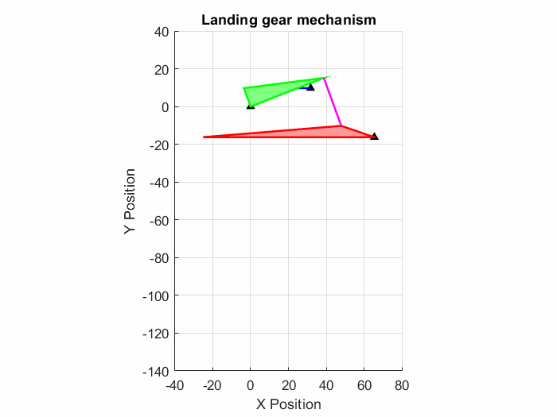

# Landing Gear Mechanism Simulation ✈️

**Kinematic analysis and visualization of a landing gear mechanism using MATLAB.**

## 📝 Overview
This project simulates the kinematic behavior of a landing gear mechanism, modeled as a four-bar linkage system driven by a hydraulic actuator. The GitHub link includes the MATLAB code (`Landing_Gear_Mechanism.mlx`) and a GIF animation showing the link trajectories (`Landing_Gear_Mechanism.gif`).

## 🚀 Features
* **Symbolic Analysis:** Uses MATLAB's Symbolic Math Toolbox to solve vector loop equations analytically.
* **Rigid Body Visualization:** Represents links as rigid triangular patches (green and red) for realistic visualization.
* **Trajectory Tracing:** Plots the path of key joints ($A, B, C, D$) using animated lines to map the workspace.
* **Valid Range Simulation:** Simulates the retraction and extension cycles within a specific input range ($21.38^\circ$ to $-25.98^\circ$) to ensure the mechanism operates without kinematic singularities.

## 📊 Simulation Result

## 📂 Files in Repository
* `Landing_Gear_Mechanism.mlx`: The main MATLAB Live Script containing the geometric setup, kinematic solver, and animation loop.
* `Landing_Gear_Mechanism.gif`: A recorded animation showing the trajectory of each link.
* `README.md`: Project documentation.

## 🛠️ How to Run
1.  Clone this repository or download the files.
2.  Open `Landing_Gear_Mechanism.mlx` in MATLAB (Requires Symbolic Math Toolbox).
3.  Run the script to solve the kinematics and generate the animation window.

## 📚 Reference
This exercise is based on **Chapter 4** of the textbook:
* *Design of Machinery: An Introduction to the Synthesis and Analysis of Mechanisms and Machines* by **Robert L. Norton**.

---
**Author:** [Your Name]
**Course:** [Your Course Name]
